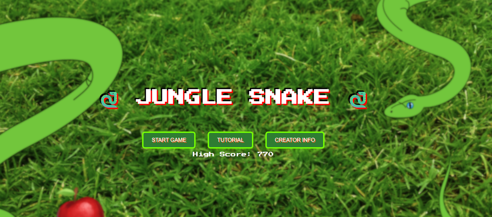
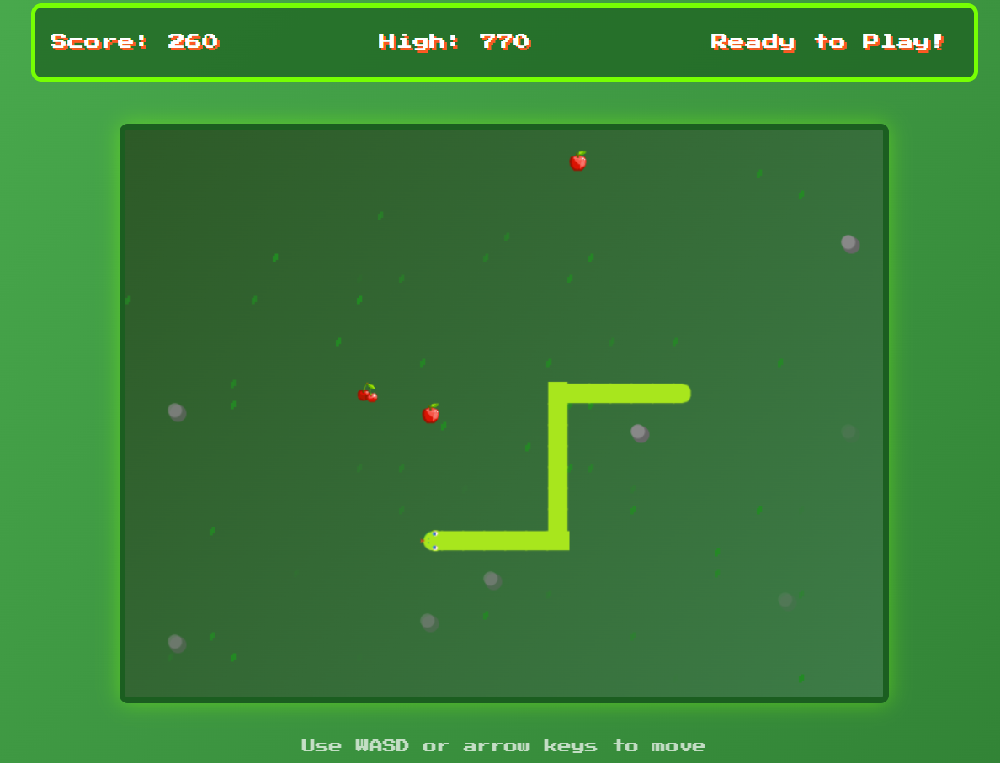

*Jungle Snake Master*

Jungle Snake Master is a modern twist on the classic Snake game, developed by Leander as a creative escape during semester exams. Powered by MediaPipe for intuitive hand gesture recognition and hosted on GitHub Pages, this game blends cutting-edge technology with nostalgic arcade thrills. Navigate the jungle, collect power-ups, and conquer the leaderboard!
Features

Hand Gesture Controls: Use MediaPipe to control the snake with intuitive hand gestures (or opt for keyboard controls).
Dynamic Power-Ups: Collect apples, cherries, golden carrots (invincibility), weeds (slow motion), and energy drinks (speed boost).
Custom Assets: Hand-crafted graphics by Leander, adding a unique charm to every pixel.
Progressive Difficulty: Increasing speed and obstacles keep the challenge fresh.
Leaderboard: Compete to claim the top score, stored locally.

Demo

Play the game live on [GitHub Pages](https://leanderdfernandes.github.io/Gesutre_Snake_Game/)!  

Installation
To run Jungle Snake Master locally:

Clone the Repository:
git clone https://github.com/leanderfernandes/Gesture_Snake_Game.git
cd Gesture_Snake_Game

Serve the Game:

Use a local server to avoid CORS issues (required for MediaPipe and assets).
Example with Python:python -m http.server 8000

Or use Node.js http-server:npm install -g http-server
http-server .

Open in Browser:

Navigate to http://localhost:8000 in a modern browser (Chrome, Firefox recommended).
Ensure webcam access is enabled for gesture controls.

Dependencies: No installation required! The game uses CDN-hosted MediaPipe libraries and runs entirely in the browser.
Usage

Controls:
Hand Gestures (requires webcam):
Index finger up: Move up
Thumb left: Move left
Pinky right: Move right
Closed fist: Move down

Keyboard:
WASD or Arrow keys to move

Objective: Collect food to grow the snake and earn points. Avoid rocks and collisions unless invincible!
Power-Ups:
Apple: +10 points
Cherry: +20 points
Golden Carrot: Invincibility (50 points)
Slow motion: Slow motion (30 points)
Energy Drink: Speed boost (40 points)

Start playing from the main menu, test gestures in the tutorial, and aim for the high score!
